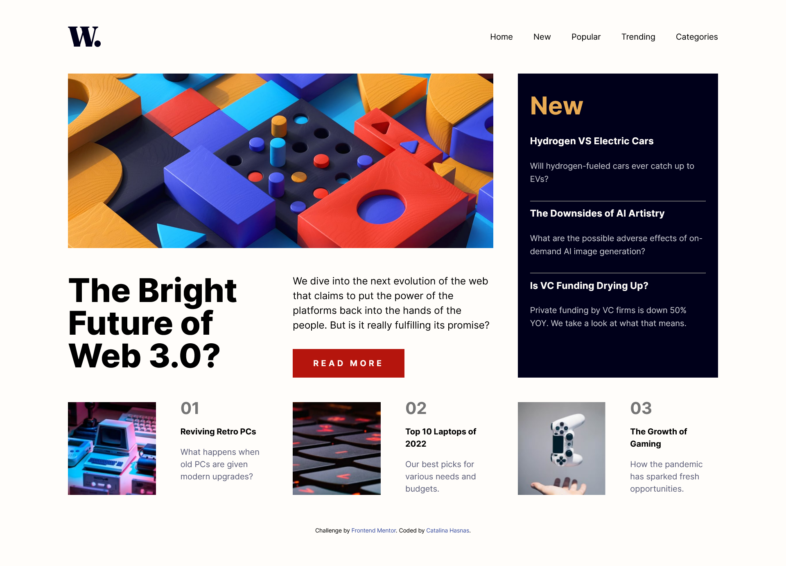

# Frontend Mentor - News homepage solution

This is a solution to the [News homepage challenge on Frontend Mentor](https://www.frontendmentor.io/challenges/news-homepage-H6SWTa1MFl). This solution focuses on semantic HTML, SEO and accessibility.

I use [PageSpeed Insights](https://pagespeed.web.dev/) to measure Performance, Accessibility, Best Practices and SEO.

The branch [old_version](https://github.com/Catalina-Hasnas/news-homepage-main/tree/old-version) contains an older version of the code. With the optimization changes added in the [main](https://github.com/Catalina-Hasnas/news-homepage-main/tree/main) branch, each of the category score improved to a **perfect 100** 👌.

Read a small summary of my changes below or visit [this dev.to article](https://dev.to/catalinahasnas/improve-performance-accessibility-and-seo-of-your-projects-56l6) for the expanded version.


## Table of contents

- [Overview](#overview)
  - [The challenge](#the-challenge)
  - [Screenshot](#screenshot)
  - [Links](#links)
- [Highlights](#highlights)
  - [Semantic HTML](#semantic-html-a-foundation-for-accessibility-and-seo)
  - [Image Optimization](#optimize-images-prioritizing-contentful-paint-and-layout-stability)
  - [Font Optimization](#optimize-fonts-tackling-layout-shifts-and-load-times)
  - [Javascript improvements](#efficient-javascript-reducing-overhead-and-enhancing-performance)
- [Useful resources](#useful-resources)
- [Author](#author)
- [Acknowledgments](#acknowledgments)

# Overview

## The challenge

Users should be able to:

- View the optimal layout for the interface depending on their device's screen size
- See hover and focus states for all interactive elements on the page
- Toggle between expanding and collapling the menu
- Have the best user-experience


## Screenshot



## Links

- Article Link: [Improve performance, accessibility and SEO of your projects](https://dev.to/catalinahasnas/improve-performance-accessibility-and-seo-of-your-projects-56l6)
- Solution URL: [News Homepage Solution](https://www.frontendmentor.io/solutions/desktop-and-mobile-for-news-home-page-EoyPj7xyXu)
- Live Site URL: [News Homepage on Github Pages](https://catalina-hasnas.github.io/news-homepage-main/)

# Highlights

## Semantic HTML: A Foundation for Accessibility and SEO


A few changes that I made in this regard that I can highlight are:

### 1. Adding a visually hidden `<h1>` to convey information about the site for screen readers and search engines;

```html
<header>
  <h1 class="visually-hidden">Latest News in Technology</h1>
  
  <nav>...</nav>
</header>
```

```css
.visually-hidden {
  position: absolute;
  left: -10000px;
  width: 1px;
  height: 1px;
  overflow: hidden;
}
```

### 2. Consistent usage of a logical a hierarchy of `headings` in articles;


This news homepage has articles in the sidebar as well as at the bottom of the page. Notice the consistent usage of `h3` for article names, `h4` for article description. Even though _“02”_ is the largest text in the article, it is a simple `span` due to _lack of meaning_.

```html
<article class="section-item">
  
  <div>
    <span>02</span>
    <h3><a href="#">Top 10 Laptops of 2022</a></h3>
    <h4>Our best picks for various needs and budgets.</h4>
  </div>
</article>
```

```html
<article>
  <h3><a href="#">The Downsides of AI Artistry </a></h3>
  <h4>
    What are the possible adverse effects of on-demand AI image generation?
  </h4>
  <hr />
</article>
```

### 3. Correct usage of links and buttons;

The central button that says: **Read more** is actually a link styled like a button. Its purpose is to take a user to a new _location_, where he can read the entire article. Buttons trigger an _action_, for example, toggle the menu from opened to closed, which we’re going to touch upon later.


### 4. Adding `title` and `desc` elements to provide text alternatives for SVG content;

```html
<svg>
  <title>Open Navigation Menu</title>
  <desc>Button that opens the menu containing navigation links</desc>
  …
</svg>
```

### 5. Correct usage of `aria-` attributes;

`aria-` attributes provide additional semantics about the role, state, and functionality of an element, which can be especially helpful for assistive technologies like screen readers. Let’s take a look at our toggle button.
Aria-label represents the name of this button that doesn’t have text. It is read by screen readers to help visually impaired users know the purpose of the button.
The aria-expanded indicates to assistive technology whether the controlled element (the menu) is expanded or collapsed.

```html
<nav class="navigation-container">
  <button
    id="toggle-menu"
    aria-expanded="false"
    aria-label="toggle menu"
    aria-controls="menu"
  >
    <svg>...</svg>
  </button>
  <ul id="menu">
    <li><a href="#"> Home </a></li>
    ...
  </ul>
</nav>
```

## Optimize Images: Prioritizing Contentful Paint and Layout Stability


To address the layout shift, I implemented a few changes.

### 1. Defining the width and height attributes of images;

```html
<picture class="image">
  <source
    media="(min-width: 62em)"
    srcset="assets/images/image-web-3-desktop.jpg"
    width="850"
    height="400"
  />
  
</picture>
```

While these values do not dictate the rendered size of the image, they assist the browser in reserving the appropriate amount of space for the image. You can still style the `width` and `height` with css.

### 2. Adding high priority preloading of the image that is the largest and appears first on the screen;

```html
<link
  rel="preload"
  fetchpriority="high"
  as="image"
  href="assets/images/image-web-3-mobile.jpg"
  type="image/jpg"
/>
```

## Optimize Fonts: Tackling Layout Shifts and Load Times

Along with images, fonts are the culprits of layout shifts and prolonged load times, due to requests made to the Google Fonts API.

For this particular project, we were provided with the specific font name and weights required, enabling us to download the necessary `.ttf` files and incorporate them into our static assets. This eliminates the need for _server requests_.

While this approach accelerates the process, a shift from the fallback font still occurs, which can even alter the text’s line arrangement.


To address this, I implemented a **fallback font strategy**. Arial, being a widely available font, is adjusted using several properties with the assistance of a [Fallback Font Generator](screenspan.net/fallback). This ensures layout consistency until the desired font is loaded.

```css
@font-face {
  font-family: "Inter";
  src: url("../assets/fonts/Inter.ttf") format("truetype");
  font-display: swap;
}

@font-face {
  font-family: "Adjusted Arial Fallback";
  src: local(Arial);
  size-adjust: 109%;
  ascent-override: 86%;
  descent-override: normal;
  line-gap-override: normal;
}
```


Still a bit of a layout shift, but much better than before.

## Efficient JavaScript: Reducing Overhead and Enhancing Performance

The News homepage project doesn’t demand extensive JavaScript coding. The only user interaction opportunity is toggling between expanded and collapsed states of a menu on a button click. We also need to handle image change when the screen size changes.

Despite the project’s simplicity, I still managed to write some inefficient JavaScript code to be later improved through refactoring.

The handleResize() function is not a function that I’m proud of writing, primarily due to its _over-reliance on JavaScript for presentation logic that could be handled by CSS_.

It is attached to the window’s resize event. This means it will be called every time the window is resized, which can trigger many times per second during a resize, leading to high CPU usage.

```js
const handleResize = () => {
  const articleImage = document.getElementById("article-image");

  if (window.matchMedia("(max-width: 992px)").matches) {
    menu.classList.add("display-none");
    menu.classList.add("flex-direction-column");
    toggleMenuButton.classList.remove("display-none");
    articleImage.src = imageMobile;
  } else {
    menu.classList.remove("display-none");
    menu.classList.remove("flex-direction-column");
    toggleMenuButton.classList.add("display-none");
    articleImage.src = imageDesktop;
  }
};

window.addEventListener("resize", handleResize);

handleResize();
```

By utilizing the `srcSet` attribute on images to manage screen resizing and implementing a more efficient CSS logic, I was able to completely eliminate the handleResize function. I now have a single event listener on the toggle button to manage clicks.

Instead of adding and removing the “display-none” and “flex-direction-column” classes depending on the screen size, the toggle() method on classList adds the “expanded” class if it doesn’t exist and removes it if it does and lets CSS handle the rest.

```js
const toggleMobileMenu = () => {
  navBar.classList.toggle("expanded");
  backdrop.classList.toggle("backdrop");

  if (navBar.classList.contains("expanded")) {
    toggleMenuButton.setAttribute("aria-expanded", true);
    return;
  }
  toggleMenuButton.setAttribute("aria-expanded", false);
};

document
  .getElementById("toggle-menu")
  .addEventListener("click", toggleMobileMenu);
```

### Useful resources

- [What is semantic HTML](https://www.semrush.com/blog/semantic-html5-guide/)
- [Document and Website structure](https://developer.mozilla.org/en-US/docs/Learn/HTML/Introduction_to_HTML/Document_and_website_structure)
- [Heading Elements](https://developer.mozilla.org/en-US/docs/Web/HTML/Element/Heading_Elements)

## Author

- [dev.to account](https://dev.to/catalinahasnas)
- [Frontend Mentor account](https://www.frontendmentor.io/profile/Catalina-Hasnas)
- [LinkedIn Account](https://www.linkedin.com/in/catalina-hasnas-7481731b8/)

## Acknowledgments

[This video](https://www.youtube.com/watch?v=BkDH55WDiDU) on technical SEO where I took a lot of inspiration from.
